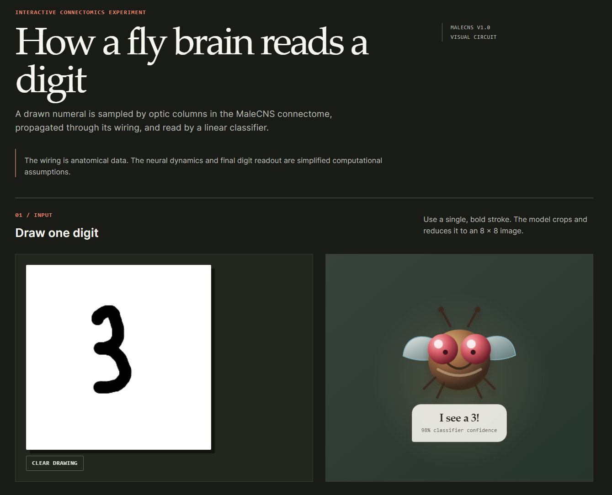

# MaleCNS Fly Brain Classifier



An interactive experiment that sends a handwritten digit through a fixed visual subgraph from the MaleCNS v1.0 fruit-fly connectome.

```text
drawn digit → optic-column inputs → fixed MaleCNS wiring → sparse readout → prediction
```

The circuit uses measured connectivity and synapse counts. Input encoding, dynamics, and the digit readout are software choices. This is not a simulation of a fly recognising handwritten digits.

## Run the app

Requirements: Python 3.10+, Node.js 18+, and npm 9+.

```powershell
pip install -r requirements.txt
cd frontend
npm install
npm run build
cd ..
python -m uvicorn backend.main:app --port 8000
```

Open <http://localhost:8000>, draw a digit, and inspect the reduced 8×8 input, optic-column sampling, circuit activity, and prediction.

### RTX 5080 / CUDA

The differentiable model selects CUDA automatically and falls back to CPU when CUDA or the required sparse operation is unavailable. For an RTX 5080, install the CUDA environment:

```powershell
pip install -r requirements-cuda.txt
python -c "import torch; print(torch.__version__, torch.cuda.is_available(), torch.cuda.get_device_name(0))"
python scripts/train_differentiable_probe.py --device cuda
```

The API uses `MALECNS_DEVICE=auto` by default. Set it to `cuda` to require the GPU or `cpu` for a reproducible CPU run.

```powershell
$env:MALECNS_DEVICE = "cuda"
python -m uvicorn backend.main:app --port 8000
```

## Train and evaluate

The app uses `models/differentiable_probe.pt` when present; otherwise it uses the legacy linear probe.

```powershell
# Train the fixed-connectome model.
python scripts/train_differentiable_probe.py --device auto

# Compare real wiring with matched rewired controls across ten fixed seeds.
python scripts/benchmark_differentiable.py --device auto
```

The benchmark writes `models/differentiable_benchmark.json`. A circuit benefit is reported only when the real circuit exceeds every control by at least one percentage point on mean held-out temporal accuracy and the paired sign-flip test is below 0.05.

The older baseline remains available when needed:

```powershell
python scripts/train_probe.py
python scripts/benchmark.py
```

## Development and verification

For frontend hot reload, run the API and Vite separately:

```powershell
# Terminal 1
python -m uvicorn backend.main:app --port 8000 --reload

# Terminal 2
cd frontend
npm run dev
```

Vite runs at <http://localhost:5173> and proxies API calls to port 8000.

```powershell
python -m pytest -q
cd frontend
npm run build
```

The API exposes:

- `GET /api/meta` — circuit facts, model version, device, and benchmark metrics.
- `POST /api/predict` — a canvas PNG data URL in; prediction and visualisations out.

## Rebuild the circuit artifact

The repository includes a pre-built visual subgraph. Rebuilding it requires a neuPrint token from <https://neuprint.janelia.org>.

```powershell
$env:NEUPRINT_APPLICATION_CREDENTIALS = "your-token"
python scripts/build_circuit.py
python scripts/train_differentiable_probe.py --device auto
python scripts/benchmark_differentiable.py --device auto
```

`build_circuit.py` selects optic-column inputs, queries a two-hop MaleCNS subgraph, normalises its sparse matrix, and writes `data/malecns_circuit.npz` plus metadata.

## Project layout

```text
backend/        FastAPI API and static frontend serving
frontend/       React canvas interface and visualisations
src/            circuit loading, image encoding, simulation, and rewiring
scripts/        circuit build, model training, and benchmarks
data/           circuit artifact and metadata
models/         locally generated checkpoints and metrics
tests/          Python regression tests
```

## Scientific scope

MaleCNS provides anatomical connectivity and synapse counts, not measured activity for this task, an image encoder, synaptic signs, or a digit classifier. Simulated states are therefore model outputs, not recorded fly neural activity. The rewired controls are included to test whether this particular wiring adds value beyond matched graph statistics.

## Data, attribution, and license

MaleCNS v1.0 is the public complete adult male *Drosophila* CNS connectome. This demo uses a small visual subgraph of that release. MaleCNS-derived data are CC-BY and retain their upstream attribution requirements; the repository code is MIT licensed and does not relicense the data.

Sources: [MaleCNS supplemental data](https://github.com/flyconnectome/2025malecns) · [neuPrint](https://neuprint.janelia.org)

For research use, cite the MaleCNS v1.0 release described by the source repository above.

## Troubleshooting

If port 8000 is occupied, use another port:

```powershell
python -m uvicorn backend.main:app --port 8001
```

If the frontend is running through Vite, keep the API on port 8000 unless you also update the proxy configuration.
